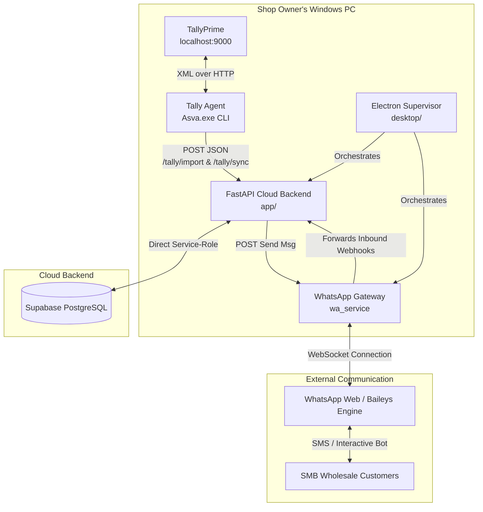

# ASVA — WhatsApp-Native Business Automation & Ledger Sync for TallyPrime

ASVA is a production-grade, WhatsApp-native business automation and ledger-synchronization platform designed for Indian wholesale Small & Medium Businesses (SMBs). It hooks directly into local **TallyPrime** installations, syncs accounting records (vouchers, receipts, outstanding debt) to a cloud database, automatically formats print-ready PDF invoices, coordinates credit-term-aware collections over WhatsApp, and delivers consolidated daily reports to business owners.



---

## 🛠️ System Architecture & Services

The repository is organized into four self-contained, cooperating components:

### 1. Cloud Backend Service (`app/`)
A high-performance **FastAPI** web service (typically deployed to Railway or run locally).
*   **Data Tier**: Connects to **Supabase (PostgreSQL)** using a service-role key to bypass Row Level Security (RLS) for write-heavy syncs. Tenant separation is enforced at the application layer by strict scoping on `business_id` in every SQL query.
*   **In-Process Scheduler**: Powered by `APScheduler` inside a **single Uvicorn worker process** (to prevent task duplication).
    *   **Reminder Sweep (10:00 AM)**: Inspects debtor balances, computes age-of-debt, respects weekly off-days/holidays (blackouts), and schedules automated payment reminder alerts.
    *   **End-of-Day Digest (21:00 PM)**: Runs pure SQL aggregates (no heavy ORM overhead) to generate a summary of daily sales, collection receipts, and message delivery metrics.
    *   **Keep-Alive Ping (6-hourly)**: Keeps free-tier databases active.
*   **Lazy PDF Engine**: Generates PDF invoices dynamically via `WeasyPrint` using HTML/CSS templates ([`templates/invoice.html`](file:///c:/Users/laksh/whatsapp-tally-saas/templates/invoice.html)). GTK/Pango system libraries are dynamically loaded at runtime to ensure the backend starts successfully even in degraded local environments.

### 2. Tally Desktop Agent (`tally_agent/`)
A lightweight, standalone Windows console executable compiled using `PyInstaller`.
*   **Data Extraction**: Queries local TallyPrime (`localhost:9000`) over HTTP using inline, TDL-free raw XML payloads ([`tally_agent/tally_xml.py`](file:///c:/Users/laksh/whatsapp-tally-saas/tally_agent/tally_xml.py)) to fetch ledger entries, outstanding amounts, and day book logs.
*   **Network Gateway**: Normalizes and structures Tally data into JSON payloads (`TallyImportPayload` / `TallySyncPayload`) and POSTs them to the backend API.
*   **Robustness**: Parses Tally's nested Street/Route sub-groups, handles character encoding (decodes UTF-16-BOM/UTF-8 variants), corrects ledger balance signs (Tally represents debts as negative numbers), and limits sync query sizes to prevent HTTP connection timeouts.

### 3. WhatsApp Gateway Service (`wa_service/`)
A lightweight Node.js daemon that wraps WhatsApp Web interface APIs (using Baileys / `whatsapp-web.js`).
*   **Device Linking**: Displays a terminal-based or local web page QR code (`/qr` on the gateway port) to scan and authenticate the shop owner's WhatsApp account.
*   **Two-Way Transport**: Exposes an HTTP API for sending outbound messages (PDFs, templates, interactive reminders) and translates incoming messages into webhooks forwarded back to the FastAPI backend.
*   **Session Management**: Stores encrypted session details locally in a Git-ignored config store (`wa_service/.baileys_auth/` / `wa_service/.wwebjs_auth/`).

### 4. Desktop Supervisor Shell (`desktop/`)
An **Electron** shell that supervises and runs the entire stack locally on a Windows machine.
*   **Process Supervision**: Spins up and manages the Uvicorn FastAPI server and Node.js WhatsApp microservice as subprocesses.
*   **User Interface**: Offers a simple system tray interface and configuration dashboard (`desktop/renderer/index.html`) displaying sync logs, database state, and QR-code status.

---

## ⚡ Core Computational Pipelines

### 🔄 Tally Ingestion & FIFO Payment Allocation
*   **Ledger Master Import (`/tally/import`)**: Seeds customers, sets active credit limits, and processes opening balances as synthetic invoices prefixed with `OB-`.
*   **Transaction Sync (`/tally/sync`)**: Upserts sales invoices using the Tally voucher number as an idempotent key.
*   **FIFO Allocation**: When receipt/payment vouchers are synchronized, the engine automatically matches and deducts payment amounts against the client's **oldest open invoices** sequentially, marking invoices as `paid` or `partially_paid`.
*   **Auto-Delivery**: Successful creation of a new invoice asynchronously queues a PDF render and sends the document directly to the client's WhatsApp in a background thread.

### 📅 Credit-Aware Reminder Sweep
*   **Ageing Engine**: Every morning, the reminder sweep computes `days_overdue = current_date - (invoice_date + client.credit_days)`.
*   **Blackout Logic**: Prevents reminders from being fired if the customer has requested a blackout period (`STOP <name>`), if reminders are globally disabled for their account, or if the current day lands on the business's weekly day off.
*   **Cadence Triggers**: Triggers structured reminders on predefined intervals (e.g., Day 7, 15, 30, 45, 60 past due).

### 🔒 Atomic Usage & Anti-Spam Safeguards
*   All WhatsApp API calls check subscription levels against tier allowances defined in the backend codebase (`PLAN_LIMITS`).
*   To prevent concurrency races (such as double-clicking or rapid API retries), the application triggers a PostgreSQL stored procedure `increment_usage_if_allowed` via a `SELECT ... FOR UPDATE` lock, keeping usage statistics transactional and thread-safe.

---

## ⚙️ Development & Local Runbook

### Prerequisites
*   **Python 3.10+** (Virtual environment recommended)
*   **Node.js 18+**
*   **Postgres** database (or Supabase instance)

### 1. Initialize the Backend
From the repository root:
```powershell
python -m venv .venv
.\.venv\Scripts\Activate.ps1
pip install -r requirements.txt
Copy-Item .env.example .env    # Populate SUPABASE_URL, SUPABASE_SERVICE_KEY, etc.
uvicorn app.main:app --reload  # API docs serve at http://localhost:8000/docs
```

### 2. Set Up the WhatsApp Service
Navigate to the WhatsApp gateway directory:
```powershell
cd wa_service
npm install
# Set environment variables: PORT=3001, WA_CHANNEL=bot
node index.js
```
Open `http://localhost:3001/qr` in a browser to scan the QR code and link your WhatsApp device.

### 3. Build & Run the Tally Agent
Install dependencies and test connection with TallyPrime (make sure Tally is configured as a server on port `9000` via `F12 -> Configure -> Data Synchronization`):
```powershell
cd tally_agent
pip install -r requirements.txt
python agent.py --import-masters    # Initial sync
python agent.py --sync              # Incremental transaction sync

# Build Windows Binary
pyinstaller --onefile --name Asva agent.py
```

### 4. Running the Electron Supervisor (Windows Integration)
Run the script-based helper to set up and boot the local desktop workspace:
```powershell
.\SETUP.bat     # Installs Node & Python dependencies
.\START.bat     # Launches Uvicorn + Node WA Gateway + Electron Frontend
```

---

## 🧪 Testing Suite

Tests are implemented using `pytest` and mock external clients to enable decoupled local testing:
```powershell
pytest                          # Run entire suite
pytest test_tally_routers.py    # Test agent-backend sync schemas
pytest test_catchup.py          # Test reminder cadence & holiday blackouts
```

---

## 💡 Engineering Guidelines & Key Constraints

*   **Single-Worker Constraints**: Uvicorn MUST run with `workers=1`. Multiple workers will boot multiple instances of APScheduler, leading to duplicated daily reports and cron reminders.
*   **Degraded Boot Capability**: If Supabase or local WhatsApp credentials are missing, the server logs a warning but boots successfully. Guard modules or helper functions requiring database connectivity must use `require_db()` validation checks.
*   **Strict Router/Service Isolation**: Controller routers (`app/routers/`) focus solely on validation, token authorization, and parsing inputs. Business rules, database operations, and notification pipelines reside exclusively in service layer classes (`app/services/`).
*   **Safe Webhook Handlers**: The webhook listener (`app/routers/webhooks.py`) handles Meta-compatible webhooks from our gateway. It filters duplicate messages by ID and always returns an HTTP `200 OK` response to prevent message broker retry loops.
